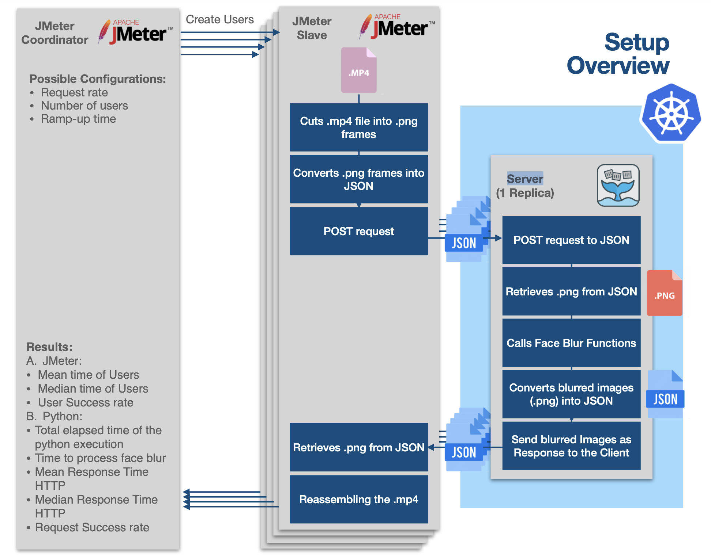

# Performance Modeling and Evaluation of Serverless AI Applications

# Introduction

Function as a Service (FaaS) is a category of cloud computing services which is becoming very popular. It provides a serverless paradigm to execute modular pieces of code (denoted as functions) on a cloud platform. Functions (that can be scaled dynamically and independently by the cloud provider) are executed transparently in Docker containers, so that users can focus only on the application code, without having to manage the infrastructure. FaaS proves to be cost-effective, especially for dynamic workloads, since users pay only for the resources they use, not for the provisioned maximum capacity required by their system. Moreover, FaaS is also well received to support AI applications in computing continua because they can benefit both from the reduced latency and increased privacy and can support partition switching of deep neural networks distributed on multiple components with the aim of optimizing the application execution time and resource usage.
In this context, some works focus on application function placement on edge-cloud [[Sedghani2021a](https://ieeexplore.ieee.org/document/9566164)] and public-private cloud [[Das2020](https://ieeexplore.ieee.org/document/9284265)] by leveraging FaaS to make a cost-efficient execution and placement of AI applications. 

# Research Goal

- This research project aims to benchmark and evaluate the performance of AI applications running in FaaS computing continuum environments
- Study the performance using an open-source face blur application
- Given a request rate/load, measure the response time of the serverless application running on a server

# Setup Overview

The following figure provides an overview over the entire setup. Our basic components are (from right to left in the below figure):

1. **Handler:** this is the OpenFaas [handler](https://github.com/CasparDietz/Serverless-AI/blob/main/VideoTransfer/src/slblur/handler.py). It receives original frames from the client via a POST request, retrieves the image string, caches the image, detects the faces, blurs them and then encodes the images and sends them back as a response to the request. The handler is part of our OpenFaas function which is running in a local Kubernetes cluster.
2. **Client:** this is the python code from the [client.py](https://github.com/CasparDietz/Serverless-AI/blob/main/VideoTransfer/src/client/client.py). It takes an .mp4 file as input, cuts it into frames, encodes them and sends them off to the handler as a POST. It then receives for each frame, the blurred frame back. The blurring is happening in the OpenFaas function. When running the client.py file you can provide as argument the think time of the client, e.g. running `python client.py 5` will introduce a think time of 5s. The code is executed by the JMeter slaves. Each slave will create several users/threads that run a copy of the client.py file.
3. **JMeter Coordinator:** This is the machine that coordinates the JMeter slaves. It is here where you can specify the parameters of the distributed load test (ramp up time and number of users). It is also the component that collects and receives all the results of the distributed load test performed by the JMeter slaves on the target (the OpenFaas function).



# Docker, Kubernetes and OpenFaas

In this section we run you trough the entire experiment setup, specifically the setup of our Kubernetes cluster, Docker and OpenFaas. What we will end up with, is a single node for the system under test, i.e. the  OpenFaas handler (”Server” in the above figure).

## **Prerequisite**

You just need to have **Docker** installed on your machine. The rest we will setup as we go along.

## Install Arkade

[arkade](https://github.com/alexellis/arkade) will be our one stop tool to install and deploy apps and services to Kubernetes. We will be using a bunch of CLI utilities to get up and running.

Make sure you install this if you have never set up a Kubernetes tooling in your system.

```bash
curl -sLS https://dl.get-arkade.dev | sudo sh
```

## Install kubectl

[kubectl](https://kubernetes.io/docs/reference/kubectl/overview/) is a command line tool that talks to the Kubernetes Master Controller API for performing actions on our cluster.

```bash
arkade get kubectl
# follow the instructions on the screen.
```

## ****Creating a local Kubernetes cluster****

We will be deploying our function on a local Kubernetes cluster so let’s set that up. We will be using a tool called **KinD (**Kubernetes in Docker**)**  for this. KinD utilizes Docker container to deploy your cluster. It is therefore comparatively faster.

### Install KinD

Our goal is to keep everything local so we will be creating a local Docker registry (Dockerhub for your local machine). KinD provides a [shell script](https://kind.sigs.k8s.io/docs/user/local-registry/) to create a Kubernetes cluster along with local Docker registry enabled.

```bash
#!/bin/sh
set -o errexit

# create registry container unless it already exists
reg_name='kind-registry'
reg_port='5000'
running="$(docker inspect -f '{{.State.Running}}' "${reg_name}" 2>/dev/null || true)"
if [ "${running}" != 'true' ]; then
  docker run \
    -d --restart=always -p "${reg_port}:5000" --name "${reg_name}" \
    registry:2
fi

# create a cluster with the local registry enabled in containerd
cat <<EOF | kind create cluster --config=-
kind: Cluster
apiVersion: kind.x-k8s.io/v1alpha4
containerdConfigPatches:
- |-
  [plugins."io.containerd.grpc.v1.cri".registry.mirrors."localhost:${reg_port}"]
    endpoint = ["http://${reg_name}:${reg_port}"]
EOF

# connect the registry to the cluster network
docker network connect "kind" "${reg_name}"

# tell https://tilt.dev to use the registry
# https://docs.tilt.dev/choosing_clusters.html#discovering-the-registry
for node in $(kind get nodes); do
  kubectl annotate node "${node}" "kind.x-k8s.io/registry=localhost:${reg_port}";
done
```

Once you have the file on your local machine. Run the following command to make it executable.

```bash
chmod +x kind-with-registry.sh
```

Now you can run the script to create your local Kubernetes cluster with local Docker registry.

```bash
./kind-with-registry.sh
```

To make sure the `kubectl` context is set to the newly created cluster; run:

```bash
kubectl config current-context
```

If the result is not `kind-kind`; then run:

```bash
kubectl config use kind-kind
```

Make sure your cluster is running:

```bash
kubectl cluster-info
```

Make sure Docker registry is running.

```bash
docker logs -f kind-registry
```

### ****Deploying OpenFaas to KinD Cluster****

Now that we have our local Kubernetes cluster up and running lets deploy our OpenFaas services to support our functions. 

```bash
arkade install openfaas
```

Make sure OpenFaas is deployed. It might take a minute or two.

```bash
kubectl get pods -n openfaas
```

## ****Port-forward to Localhost****

Now, we need to port-forward the OpenFaas gateway service to our localhost port. To check the gateway of OpenFaas service; run:

```bash
kubectl get service -n openfaas
```

Although the the cluster is deployed locally, internally Kubernetes manages it’s own IP addresses. We are port forwarding to access the service inside the Kubernetes cluster from our local machine.

```bash
kubectl port-forward -n openfaas svc/gateway 8080:8080
```

# *slblur*: The OpenFaas Function

## The Handler

The handler we used is based on the open-source [Blurry Faces repository](https://github.com/asmaamirkhan/BlurryFaces). It is a tool to blur faces or other regions in photos and videos, using Tensorflow.

You can find the yml file under the [src folder](https://github.com/CasparDietz/Serverless-AI/tree/main/VideoTransfer/src) and the handler, and requirements file in the [slblur folder](https://github.com/CasparDietz/Serverless-AI/tree/main/VideoTransfer/src/slblur) in our Git repository.  To further investigate the face.pb model we used in Tensorflow, as well as the Dockerfile, navigate to the [python3-debian folder](https://github.com/CasparDietz/Serverless-AI/tree/main/VideoTransfer/src/template/python3-debian). This folder is named python3-debian as we used this template from the OpenFaas template library. 

## Build, Push and Deploy the slblur function

At this point we are ready to build, push and deploy our function *slblur*. To do so, navigate to src folder and run the following command.

The `faas-cli up` command combines build push and deploy into one command:

```bash
faas-cli up -f slblur.yml -g http://127.0.0.1:8080
```

Now wait for about one minute and check if the function is ready, using the following command:

```bash
kubectl get deploy -n openfaas-fn
```

For more details on the deployed function, you can run the following command:

```bash
kubectl describe -n openfaas-fn deploy/slblur #Info on the deploymed function
```

# Setup of  Distributed JMeter

In this section we will explain the setup of the distributed JMeter load test we used for our experiment. First we provide an overview over the desired setup, then we run you trough the entire setup process step by step.

## Overview


## Prerequisites

For setting up JMeter, you have to have the same version of Apache JMeter and Java installed on every machine. The Apache JMeter version used for this project is located in a different [repository](https://github.com/markoprascevic/apache-jmeter/tree/main/apache-jmeter-5-2.5) than the client and the handler. It can be pulled from the git repository to ensure that every machine has the same version of apache-jmeter. Also, both the Master and Slave machines should be in the same subnet, because RMI cannot communicate across subsets without a Proxy, therefor neither can JMeter.

## Setup of the Master

On the master machine, in the scope of this project the VM with the IP address 10.75.4.83, configure the `jmeter.properties` file so that the machine knows it is the master and what machines are the remote hosts.

First we should set that the SSL is not used for RMI:

```bash
server.rmi.ssl.disable=true
```

Next step is to define the server port which will be used for the communication with the server. Additionally we need to define the local port which JMeter/RMI will use for reverse connection in order to return sample results from the slave to the client (master). 

```bash
server.rmi.port=8001
client.rmi.localport=8001
```

After the ports are defined set the remote hosts (slaves). In the case of this project:

```bash
remote_hosts=10.75.4.82
```

Finally, change the required attributes that allow the master to collect responses in non-batch mode in the  jmeter.properties file.

Since JMeter 2.9, default is MODE_STRIPPED_BATCH, which returns samples in batch mode (every 100 samples or every minute by default), it was changed to standard, so that it is certain that we collect all responses needed.

```bash
mode=Standard
jmeter.save.saveservices.response_data=true
jmeter.save.saveservices.response_data.on_error=true
```

Last but not least,  disable the firewall on the corresponding ports. Since the attribute `client.rmi.localport` is defined, port 8001 will be used as the base for local port numbers for the client engine. JMeter will open up three ports beginning from `client.rmi.localport`, which is in this case 8001, 8002 and 8003. Because the machines use UFW firewall settings, the following commands need to be ran in the terminal to disable the firewall on the apprehend mentioned ports:

```bash
sudo ufw allow 8001
sudo ufw allow 8002
sudo ufw allow 8003
```

## Setup of the Slave

For setting up the Slave machine we also configure the [jmeter.properties](http://jmeter.properties) file.

First of all, as it was required for the Master machine, also here we need to disable SSL for RMI.

```bash
server.rmi.ssl.disable=true
```

Again, define the ports that are going to be used:

```bash
server_port=8001
server.rmi.localport=8001
```

As the slave machine uses one port, we need to allow traffic just on the defined port. Therefore, disable the firewall on that port using ufw again.

```bash
sudo ufw allow 8001
```

## Specifying the Test Plan

Now that the slave and master machines have been configured correctly, the next step consist of loading our [.jmx files](https://github.com/markoprascevic/apache-jmeter) on the master machines. You can find the .jmx files we used in our experiments on the master machine, in the folder apache-jmeter. The .jmx files are configured to have the the initial request rate of 0.25 transactions per second. Additionally, configure the the OS Process Sampler to invoke the correct function (`client.py`) and the appropriate listeners attached to that test plan.

The initial request rate is configured in the Thread Group (which is added to the Test plan) by specifying an appropriate ramp-up time for the given number of threads. An example for 9 threads is given bellow.


The OS Process Sampler is added to the Thread Group and configured so that it contains the Python path which represents the command, and the path to the working directory where the Python script that needs to be executed is contained. Command parameters, represent the Python script and the think time of the users. In the below example, the .jmx file is configured to have a think time of 0s. 


A “View Result Tree” listener is added to the Test Plan to collect results to the given file. 


Make sure to also configure the “Save as XML” and “Save Response Data (XML)”. This allows us to save the handler’s responses.


Adding the configuration of the upper mentioned fields, it enables the saving of responses to an XML file.

## Starting the Communication

After setting up the environments and configuring the .jmx files, the machines are ready to start the communication between the master and the slave.

Firstly, start the slave machine as a JMeter server. That is accomplished by the following command:

```bash
./jmeter-server -Jmode=standard
```

While running this command in the terminal, the slave machine is listening on the specified port and is ready to receive requests. Now it is time to start the master with an appropriate .jmx file

```bash
sh jmeter.sh -n -t path_to_jmx_files -l csv_file_to_be_saved -e -o path_to_html_folder -R remote_master_ip
```

For better understanding:

```bash
-n is to start jmeter in non-gui mode
-t is to say that the .jmx file follows
-l the path to the csv file follows
-e -o are the parameters needed to specify that the jmeter results should create a html page with the JMeter dashboard
-R specifies the remote jmeter that we are trying to reach
```

After finishing the test, the server will show a note that the test is finished. On the master side there will be a summary shown of the test that was ran. Two files will be created, one containing the .csv report of the finished test, and a .xml file containing the responses from the client and the server. Also a generated dashboard will be available in the specified folder.

# Results

There are two ways of collecting results. The results of `ML Time`, `Total Time` and `Round Trip Time` were collected as responses from the python [handler.py](http://handler.py) function, collected in an XML file. From the file we extracted the three arrays representing the mentioned Times for every request. All three times are calculated as differences between timestamps in the handler.py (see the blow figure for more detail). The success rate of each thread was calculated by dividing the number of elements in the `Round Trip Time` array by the number of elements in the `ML Time` array. If a request didn’t succeed for a thread we would have a `Round Trip Time` equal or slightly larger the 25 seconds (25s is the default timeout setting of OpenFaas), but the corresponding element in the `ML Time` array would be missing (because the request timed out and we never received a response from the handler.py). The mean R`ound Trip Time` for the number of threads was acquired by calculating the average `Round Trip Time`, taking every thread into consideration.

Below you can see:

- **`Round Trip Time`:** this is the total time it took for the POST request to be sent until the client receives a reply, i.e. the blurred frame. This time can therefore also be seen as the response time. It is exclusively calculated in the client.
- **`Total Time`:** this is the total runtime of the python handler in the OpenFaas function. This is measured in the handler.
- **`ML Time`:** this is the time it took to run the face blur in the handler. This is measured in the handler.


## ****Round Trip Time, Total Time in Handler & ML Time in Handler****

We plotted the data we received from the handler using the [python notebook](https://github.com/CasparDietz/Serverless-AI/blob/main/Plots.ipynb) in the repository. There you can also see the bespoken arrays we collected from the handler. 

As you can see from the plots below, we always plotted three different sleep times (or “think time”) for each number of threads: 0s, 1s and 5s (from left to right). We also always reported the mean and median round trip time, as well as the success rate for each number of threads and think times (or sleep). Both is always reported under the graphs.


## ****Success Rate over Number of Threads/Sleep Time****

In the following graph, we plotted the request success rate over the number of threads. The different colours indicate the different think times, again we plotted the data for 0s, 1s and 5s.


## ****Mean Response Time over Number of Threads/Sleep Time****

In this last plot, we plotted the mean response time over the number of threads. Again, the different colours indicate the different think times.


# Presentation PDF

[Serverless AI Update Presentation.pdf](images/Serverless_AI_Update_Presentation.pdf)

# Git Repositories

Repository containing the entire code for the OpenFaas, KinD, Kubernetes setup as well as the client:

[https://github.com/CasparDietz/Serverless-AI](https://github.com/CasparDietz/Serverless-AI)

Repository containing the JMeter setup and config file:

[https://github.com/markoprascevic/apache-jmeter](https://github.com/markoprascevic/apache-jmeter)
